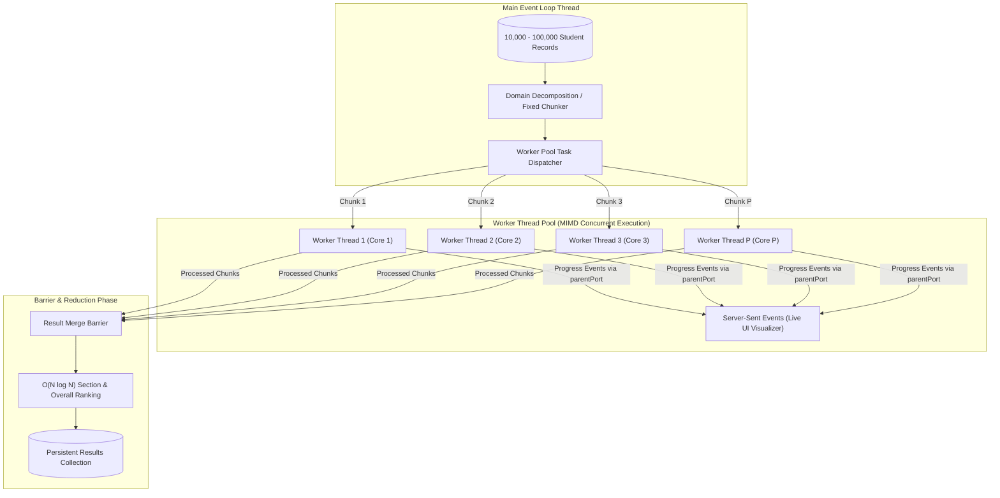

# Digital EPS: High-Performance Examination Management & CAPP Parallel Processing Engine

A production-style, full-stack **Examination Management and High-Performance Result Processing System** engineered for demonstration in **Computer Architecture and Parallel Processing (CAPP)**.

The system features an enterprise-grade academic lifecycle (curriculum, faculty assignments, examination scheduling, spreadsheet-like marks entry with validation, student grade cards, and re-evaluation approval flows) powered by an autonomous, multi-threaded **Node.js `worker_threads`** calculation engine.

---

## ⚡ Tech Stack

- **Frontend**: React 19, Vite, React Router 7, Tailwind CSS, Recharts, Framer Motion, Lucide Icons, Canvas-Confetti
- **Backend**: Node.js v24, Express.js REST API, Server-Sent Events (SSE) for zero-lag thread telemetry
- **Database**: MongoDB with Mongoose (features an automated In-Memory MongoDB fallback if local `mongod` is absent)
- **Authentication**: JWT, bcrypt, Role-Based Access Control (`Admin`, `Teacher`, `Student`)
- **Parallel Computing Core**: Node.js `worker_threads` Worker Pool with configurable thread counts ($1, 2, 4, 8, \dots, N_{cpu}$), domain decomposition chunking, fault-tolerant retries, and Amdahl's Law speedup analytics.

---

## 🚀 Quick Start Guide

### Prerequisites
- Node.js (v18 or higher; v20+ recommended)
- npm (v9+)

### 1. Backend Server Setup
```bash
cd server
npm install
npm run start
```
> **Note**: When `server.js` boots, it automatically connects to your local MongoDB or transparently spins up an In-Memory MongoDB instance if no local daemon is running. It also automatically seeds all demo accounts, academic subjects, faculty assignments, exams, and marks on first startup!

### 2. Frontend Client Setup
```bash
cd client
npm install
npm run dev
```
Open **[http://localhost:5173](http://localhost:5173)** in your browser.

---

## 🔑 Pre-Seeded Demo Credentials

| Role | Email | Password | Access / Privileges |
| :--- | :--- | :--- | :--- |
| **👑 Admin (Exam Cell)** | `admin@eps.edu` | `Password@123` | Full access: Academic setup, exam lifecycle, lock/unlock, result processing, performance lab, re-evaluation reviews, and audit trails. |
| **👨‍🏫 Teacher (Faculty)** | `teacher@eps.edu` | `Password@123` | Marks entry grid and CSV upload for assigned cohorts (CS301 & CS302 Sec A/B), and result inspection. |
| **🎓 Student (Candidate)** | `student@eps.edu` | `Password@123` | View semester transcripts, CGPA/SGPA milestones, print official grade card, and lodge re-evaluation petitions. (Roll: `24CS001`) |

*Tip: Quick one-click login buttons are available on the login page.*

---

## 🧠 CAPP Core: How Parallel Processing Works



### 1. Problem Decomposition & Chunking
The dataset is split into independent slices.
- **Fixed-Batch Chunking**: Slices dataset into uniform chunks of size $C = \lceil N / P \rceil$, ensuring load balancing across cores.
- **Section-Wise Chunking**: Partitions records by academic section (Section A, Section B, etc.), aligning with natural domain boundaries and ensuring cache locality.

### 2. Worker Pool Amortization
Repeatedly creating OS threads wastes hundreds of milliseconds in kernel stack allocation. The **Worker Pool** (`WorkerPool` class) maintains persistent pre-spawned worker threads that receive tasks through message channels, eliminating thread spawning penalties.

### 3. Fault Tolerance & Automatic Recovery
If an uncaught exception or crash occurs in a worker thread, the pool catches the exit event, spawns a fresh replacement worker, and requeues the unfinished chunk (up to 2 retries).

### 4. Amdahl's Law Asymptotic Limits
The theoretical speedup of the engine is governed by Amdahl's Law:
$$S(P) = \frac{1}{(1 - f) + \frac{f}{P}}$$
Where:
- $f$ is the **parallel fraction** (validation, total calculation, grade boundary evaluation, grace marks award, SGPA calculation).
- $1 - f$ is the **strictly serial fraction** (initial chunking, IPC structured cloning, and final global ranking merge).

The Performance Lab empirically measures $S = T_{\text{seq}} / T_{\text{par}}$, Parallel Efficiency $E = S / P$, and Throughput (records/sec), plotting them against ideal linear speedup and theoretical limits.

---

## 📂 Project Architecture

```text
DIGITAL EPS/
├── server/
│   ├── src/
│   │   ├── config/
│   │   │   ├── db.js             # DB connector with in-memory zero-config fallback
│   │   │   └── constants.js      # Roles, exam statuses, default 10-pt grading scheme
│   │   ├── models/
│   │   │   ├── User.js           # Admin, Teacher, Student schemas with bcrypt
│   │   │   ├── Academic.js       # Department, Course, Section, Subject, GradingScheme
│   │   │   ├── Exam.js           # Scheduled, Marks Entry, Processing, Published
│   │   │   ├── Mark.js           # Marks table with compound indices
│   │   │   ├── Result.js         # Compiled results, SGPA, CGPA, ranks, backlogs
│   │   │   └── LogsAndRuns.js    # AuditLog, ProcessingRun, ReEvaluation
│   │   ├── controllers/          # Academic, Exam, Marks, Processing, Performance, Results
│   │   ├── routes/               # Express REST routers with RBAC middleware
│   │   ├── services/
│   │   │   ├── calculationService.js # Pure high-speed evaluation logic
│   │   │   ├── rankingService.js     # Section & overall ranker with tie handling
│   │   │   └── processingEngine.js   # Sequential vs. Parallel pipeline runner
│   │   ├── workers/
│   │   │   ├── resultWorker.js   # Multi-threaded worker thread script
│   │   │   ├── workerPool.js     # Persistent thread pool manager & queue
│   │   │   └── chunker.js        # Domain & batch decomposition module
│   │   ├── seed/
│   │   │   └── seed.js           # Database seeder with demo cohorts
│   │   └── server.js             # Express app, SSE progress broker, security headers
├── client/
│   ├── src/
│   │   ├── components/
│   │   │   ├── preloader/        # 2.5s animated pipeline splash screen (session guarded)
│   │   │   ├── layout/           # Sidebar with sliding indicator, Navbar, Theme toggle
│   │   │   └── ui/               # StatCard, Button, Modal, Badge, Skeleton
│   │   ├── context/              # AuthContext, ThemeContext, ToastContext
│   │   ├── pages/
│   │   │   ├── Login.jsx         # Landing & authentication with demo fill
│   │   │   ├── Dashboard.jsx     # Role-specific analytics dashboards
│   │   │   ├── AcademicSetup.jsx # Curriculum, departments, faculty assignment
│   │   │   ├── ExamManagement.jsx# Exam scheduling and lock/unlock toggle
│   │   │   ├── MarksEntry.jsx    # Editable spreadsheet grid & CSV validator
│   │   │   ├── ProcessingEngine.jsx # Sequential vs Parallel triggers & telemetry
│   │   │   ├── PerformanceLab.jsx# CAPP showpiece: Race track, worker lanes, scaling
│   │   │   ├── ResultsReports.jsx# Analytics, toppers list, CSV export
│   │   │   ├── StudentResults.jsx# Official print-ready transcript & re-eval modal
│   │   │   ├── ReEvaluationAdmin.jsx # Re-evaluation approval and recalculation
│   │   │   └── AuditLogViewer.jsx# System mutation audit trail
│   │   ├── services/api.js       # Authenticated API client
│   │   └── App.jsx               # Protected routes & role router
└── README.md
```

---

## 📡 REST API Summary

| Method | Endpoint | Access | Purpose |
| :--- | :--- | :--- | :--- |
| `POST` | `/api/auth/login` | Public | Authenticate user & issue JWT |
| `GET` | `/api/auth/me` | Authenticated | Retrieve authenticated user profile |
| `GET` | `/api/dashboard/stats` | Authenticated | Role-tailored dashboard metrics and trends |
| `GET/POST` | `/api/academic/departments` | Admin | Manage academic departments |
| `GET/POST` | `/api/academic/subjects` | Admin | Manage course subjects and credit units |
| `POST` | `/api/academic/teachers/assign` | Admin | Assign instructors to subjects & sections |
| `GET/PUT` | `/api/academic/grading-scheme` | Admin | Manage grade boundaries & grace rules |
| `GET/POST` | `/api/exams` | Admin | List and schedule university examinations |
| `PATCH` | `/api/exams/:id/toggle-lock` | Admin | Lock / unlock marks entry for an exam |
| `GET` | `/api/marks` | Faculty/Admin| Fetch student mark entries for subject & section |
| `POST` | `/api/marks/batch` | Faculty/Admin| Save spreadsheet marks entries |
| `POST` | `/api/marks/upload-csv` | Faculty/Admin| Validate & commit CSV marks batch |
| `POST` | `/api/processing/exam/:id` | Admin | Trigger Sequential or Parallel processing |
| `GET` | `/api/processing/runs` | Admin | Retrieve historical engine telemetry runs |
| `POST` | `/api/performance/generate-synthetic` | Faculty/Admin| Generate 10k to 100k synthetic test records |
| `POST` | `/api/performance/race` | Faculty/Admin| Run side-by-side Sequential vs Parallel race |
| `POST` | `/api/performance/scaling-workers` | Faculty/Admin| Benchmark scaling across 1, 2, 4, 8 threads |
| `GET` | `/api/performance/stream-progress` | Public | SSE endpoint for live worker pool progress |
| `GET` | `/api/results` | Faculty/Admin| Paginated, filtered examination results table |
| `GET` | `/api/results/analytics` | Faculty/Admin| Section pass %, toppers, and grade spectrum |
| `GET` | `/api/results/my-results` | Student | Personal semester transcripts and CGPA |
| `POST` | `/api/reevaluation` | Student | Submit re-evaluation request for subject |
| `PATCH` | `/api/reevaluation/:id/review`| Admin | Approve or reject request with recalculation |
| `GET` | `/api/audit` | Admin | Query system audit trail with filters |
